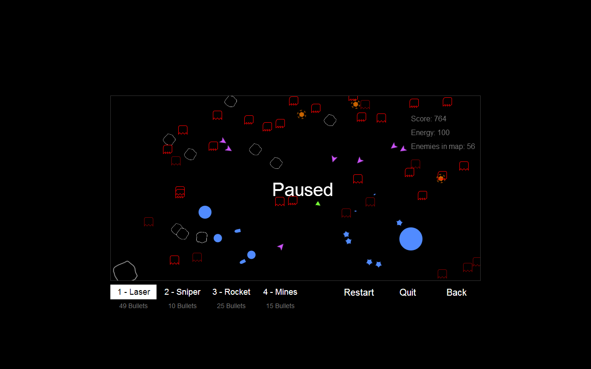
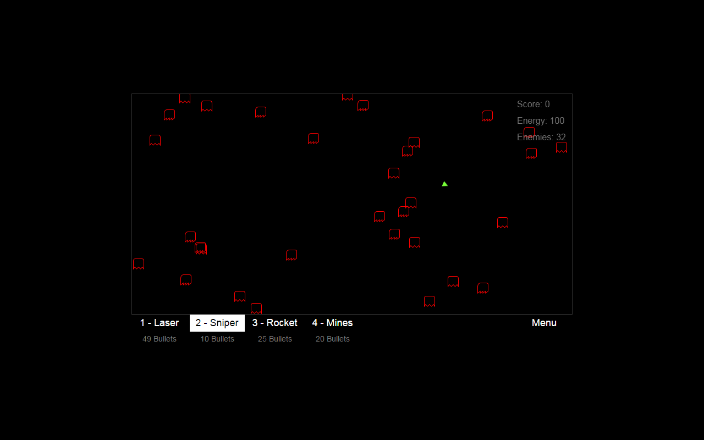
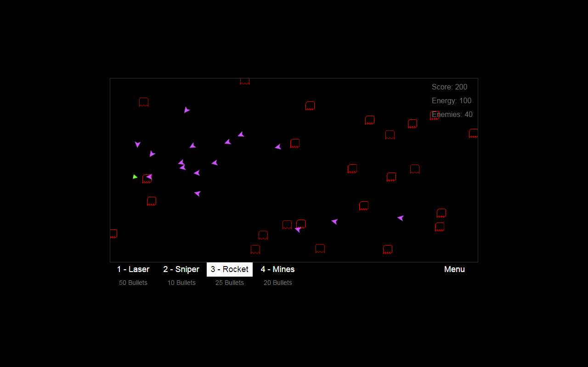

# Space Ship Game

A shooter type game, you can check it out here:

-   [chrome store](https://chrome.google.com/webstore/detail/space-ship-game/degnjhilepodhhbfomolhhohphgidmnn "chrome store")
-   [personal website](http://nbpt.eu/games/space_ship "personal website")

# Controls

-   Either `wasd` or `arrow` keys for the movement.
-   `1` to `4` to select a weapon.
-   `Left click` to fire a bullet.
-   `Mouse movement` to rotate the ship.

# Game Modes

Start Game:

-   10 predefined maps, with increasing difficulty.

Random Maps:

-   Generates the maps, with random enemy types.

Endless Mode:

-   just keeps adding enemies, that keep getting stronger as time passes.

# Weapons Description

Laser:

-   simple weapon, where one bullet can only hit one enemy.

Sniper:

-   the bullet goes through the enemies, until it reaches the end of the canvas (so it can potentially hit several enemies)

Rocket:

-   once it hits an enemy, it creates a splash damage around that area, that can hit the nearby enemies as well.

Mines:

-   they don't move, but have a bigger splash damage.

# Sounds

-   dry fire : http://freesound.org/people/brianhanson2nd/sounds/171211/ (Creative Commons 0 License)

# Music

-   [scumm bar](http://www.youtube.com/watch?v=39CSrCugHfA "scumm bar")
-   [space ship 1](http://www.youtube.com/watch?v=MJhUJ7YV7EA "space ship 1")

# Development

-   `npm install`
-   `npm start` (runs a local server at `localhost:8080/`)
-   `npm build` (build the release build)
